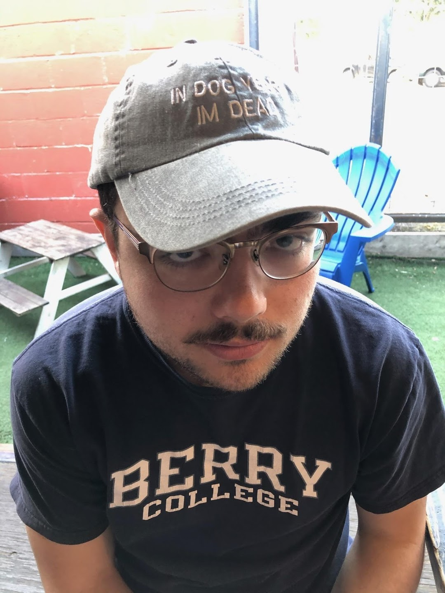

 

  

# Welcome!

I'm a PhD Candidate in political science at the University of [California, Davis](http://ps.ucdavis.edu/).

My research focuses on better understanding public opinion and political behavior, with a focus on ideological and affective polarization, using advanced methods like dimensional analysis and machine learning. I've also worked recently on COVID-19 attitudes and behaviors.

(Also) I received a B.S. in both political science and economics from [Berry College](https://berry.edu).

